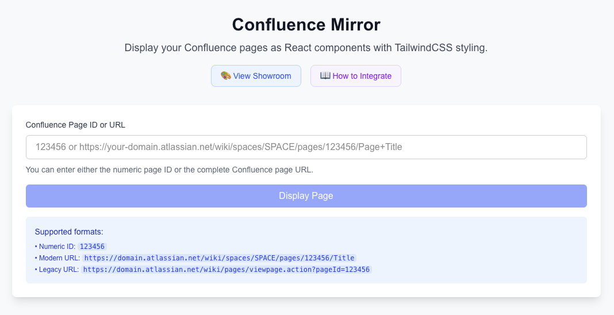

# Confluence Mirror

Transform your Confluence pages into beautiful React components! This project demonstrates how to seamlessly integrate Confluence content into modern web applications.



> **Disclaimer:** This is an unofficial project, not affiliated with Atlassian.

## 🏗 Project Structure

This repository contains:

- **packages/core** - `confluence-mirror-core`: Framework-agnostic Confluence API & ADF processing
- **demo/** - Complete implementation example with reusable React components

## 🚀 Quick Start

```bash
# Clone and run the demo
git clone https://github.com/Gravitek-io/confluence-mirror
cd confluence-mirror
npm install
npm run dev
```

Visit http://localhost:3000 to see the demo in action.

## 🎯 Integration Approaches

### Option 1: Install Core Package + Copy Components

```bash
# Install the core logic
npm install confluence-mirror-core

# Copy reusable components from demo
cp -r demo/src/components/confluence/ your-project/src/components/
cp demo/src/lib/confluence.ts your-project/src/lib/
```

### Option 2: Fork This Repository

Fork this repository and customize the demo app for your needs.

## 📦 Core Package

### confluence-mirror-core

Framework-agnostic core logic for Confluence integration:

- ✅ Confluence REST API client
- ✅ ADF (Atlas Document Format) processing  
- ✅ Media URL rewriting
- ✅ Table of contents extraction
- ✅ TypeScript types

## 📖 Documentation

- [Core Package Documentation](./packages/core/README.md)
- [Demo App Setup & Integration Guide](./demo/README.md)

## 🤝 Contributing

Contributions welcome! Please read our contributing guidelines and submit pull requests.

## 📄 License

Apache-2.0 © Gravitek
